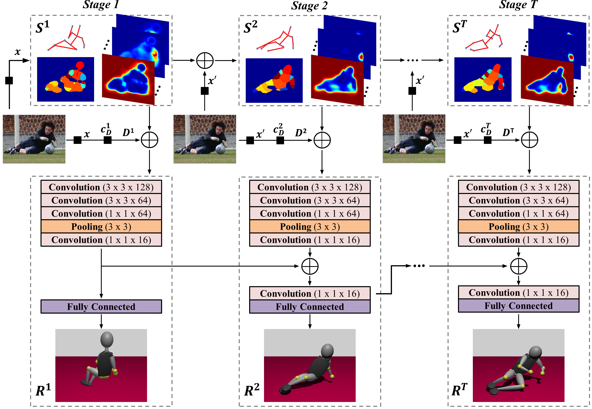
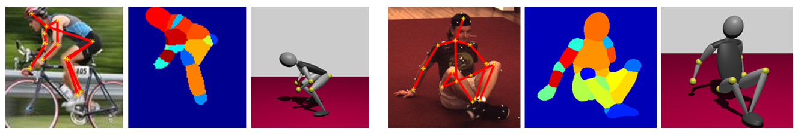

# Deep Multitask Architecture for Integrated 2D and 3D Human Sensing

This package contains code for the Deep Multitask Human Sensing (DMHS) method, published in the CVPR 2017 paper [Deep Multitask Architecture for Integrated 2D and 3D Human Sensing](http://www.maths.lth.se/matematiklth/personal/sminchis/papers/dmhs-cvpr17.pdf). 



By using the software, you are agreeing to the terms of the [license agreement](https://github.com/alinionutpopa/dmhs/blob/master/LICENSE).

Our software is built on top of the [Caffe](http://caffe.berkeleyvision.org/) deep learning library used by the [Convolutional Pose Machines](https://github.com/shihenw/convolutional-pose-machines-release) model. The current version was developed by:

[Alin-Ionut Popa](http://109.101.234.42//people.php?ID_p=23)
and
[Mihai Zanfir](http://109.101.234.42//people.php?ID_p=17).

Supervisor: [Cristian Sminchisescu](http://www.maths.lth.se/matematiklth/personal/sminchis/index.html)

We provide a deep multitask architecture for fully automatic 2d and 3d human sensing (DMHS), including recognition and reconstruction, in monocular images. The system computes the figure-ground segmentation, semantically identifies the human body parts at pixel level, and estimates the 2d and 3d pose of the person. This software allows you to test our algorithm on your own images.



If you use this code/model for your research, please cite the following paper:
```
@inproceedings{dmhs_cvpr17,
    author = {Alin-Ionut Popa and Mihai Zanfir and Cristian Sminchisescu},
    title  = {Deep Multitask Architecture for Integrated 2D and 3D Human Sensing},
    booktitle = {IEEE International Conference on Computer Vision and Pattern Recognition},
    year   = {2017}
}
```


## Installation Guide
First, clone the project by running:
```
git clone --recursive https://github.com/alinionutpopa/test.git
```

You need to compile the modified Caffe library in this repository. Instructions for Ubuntu 14.04 are included below. You can also consult the generic [Caffe installation guide](http://caffe.berkeleyvision.org/installation.html) for further help.


### 1.1 Install dependencies
##### General dependencies
```
sudo apt-get install libprotobuf-dev libleveldb-dev libsnappy-dev libopencv-dev libhdf5-serial-dev protobuf-compiler
sudo apt-get install --no-install-recommends libboost-all-dev
```

##### CUDA (optional - needed only if you are planning to use a GPU for faster processing)
Install the correct CUDA driver and its SDK. Download CUDA SDK from Nvidia website. 

You might need to blacklist some modules so that they do not interfere with the driver installation. You also need to uninstall your default Nvidia Driver first.
```
sudo apt-get install freeglut3-dev build-essential libx11-dev libxmu-dev libxi-dev libgl1-mesa-glx libglu1-mesa libglu1-mesa-dev
``` 
open /etc/modprobe.d/blacklist.conf and add:
```
blacklist amd76x_edac
blacklist vga16fb
blacklist nouveau
blacklist rivafb
blacklist nvidiafb
blacklist rivatv
```
```
sudo apt-get remove --purge nvidia*
```

When you restart your PC, before loging in, try "Ctrl + Alt + F1" to switch to a text-based login. Try:
```
sudo service lightdm stop
chmod +x cuda*.run
sudo ./cuda*.run
```

##### BLAS
Install a BLAS library such as ATLAS, OpenBLAS or MKL. To install BLAS:
```
sudo apt-get install libatlas-base-dev 
```

##### Python 
Install Anaconda Python distribution or install the default Python distribution with numpy, scipy, etc.

##### MATLAB (optional - needed only if you are planning to use the MATLAB interface)
Install MATLAB using a standard distribution.

### 1.2 Build the custom Caffe version
Set the path correctly in the ``Makefile.config``. You can rename the ``Makefile.config.example`` to ``Makefile.config``, as most common parts are filled already. You may need to change it a bit according to your environment.

After this, in Ubuntu 14.04, try:
```
make
```

If there are no error messages, you can then compile and install the Python and Matlab wrappers:
To install the MATLAB wrapper:
```
make matcaffe
```


All done! Try our method!


### 1.3 Run the demo
First download the model that includes the trained weights from this [link](https://drive.google.com/open?id=0B2xD_tIOYyL1RlFhVGg4Y0VXYlk) into the ``model`` folder. 

The MATLAB script for running the demo is ``demoDMHS.m``. Change the ``displayMode`` variable to ``1`` in order to visualize the results.

Please note that our method requires an image cropped around the bounding box of the person. Also, please validate the scales for the 3D pose estimation and body part labeling tasks.

Contact: <alin.popa@imar.ro> , <mihai.zanfir@imar.ro>


### Acknowledgments
This work was supported in part by CNCS-UEFISCDI under PCE-2011-3-0438, JRP-RO-FR-2014-16.
